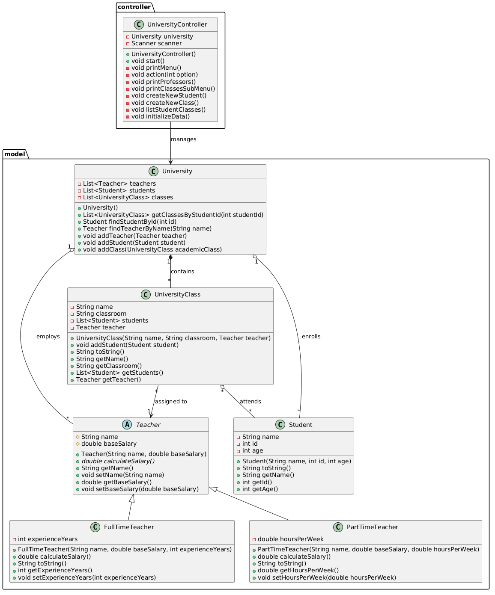

# University Tracking System - Java Basics TAE Final Project
This repository contains the final project for the Java Basics Module from the TAE course. The system manages university operations, including teacher salary calculations, student enrollment, and class scheduling.

## 🛠️ Requirements & Implementation
The project implements the following core Java concepts:

* Inheritance & Polymorphism: Used in the Teacher hierarchy to handle different salary calculation logic.

* Encapsulation: All model attributes are private or protected, accessed via getters and setters.

* Static Members: Implementation of a static ID counter in the Student class for unique identification.

* Packages: Separation between model (data) and controller (logic).

* Access Modifiers: Proper use of public, private, and protected to secure data.

## 🏗️ Class Diagram
